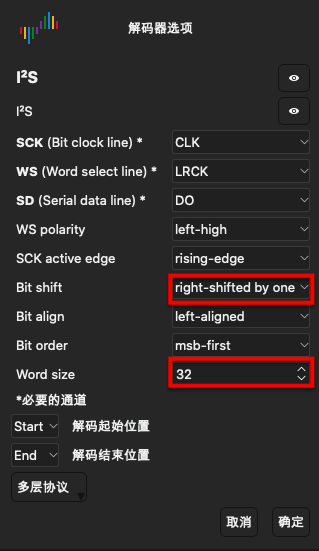

# dsviewi2s

A simple tool to convert the data exported from DSView to raw audio file which
could be imported to Audacity.

# Rational

DSView as of now has no function to decode the I2S data, this tool is used to
convert the data to raw audio file.

# How to Install

After clone this repo, in the `dsview2is` directory:

```
python3 setup.py install
```

This will install the tool `dsview2is` as well as its dependencies and add the
`dsview2is` to your "PATH".

# How to use

Using DSView to capture the data, and export data to csv file

The file looks like:

```
Id,Time[s],I²S
0,4.82e-06,Left channel: 00007df3
1,1.54e-05,Right channel: 00000651
2,2.582e-05,Left channel: 00000651
3,3.624e-05,Right channel: 00000e93
4,4.666e-05,Left channel: 00000e93
5,5.708e-05,Right channel: 00001695
6,6.75e-05,Left channel: 00001695
7,7.792e-05,Right channel: 00001e35
```

Usage:

```
usage: dsviewi2s [-h] [-c CHANNEL] [-v DEBUGCOUNT] [-d DATAWIDTH] csv output

positional arguments:
  csv                   csv file from dsview
  output                output bin file

optional arguments:
  -h, --help            show this help message and exit
  -c CHANNEL, --channel CHANNEL
                        "left" or "right"
  -v DEBUGCOUNT, --debugcount DEBUGCOUNT
                        print first n values in verbose mode
  -d DATAWIDTH, --datawidth DATAWIDTH
                        data width in bytes, 2 for 16bits, 4 for 32bits,this is for both csv and output, that means if the csv is 32bits, the output is also 32bit
```

Following command convert left channel in the csv file to audio.bin:

```
dsviewi2s -c left -d 4 DSLogic-la-200904-172721.csv audio.bin
```

# Notes

In DSView, the when capturing the data, it is important to understand that the
I2S data format on the I2S bus, In normal case, the fisrt bit is the second
sampled at the second rising edge after LRCK, so we have to shift by one bits:



# Disclaimer

The Software and code samples available are provided "as is" without warranty
of any kind, either express or implied. Use at your own risk.
